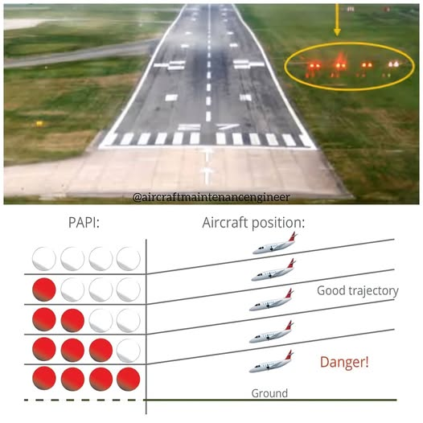
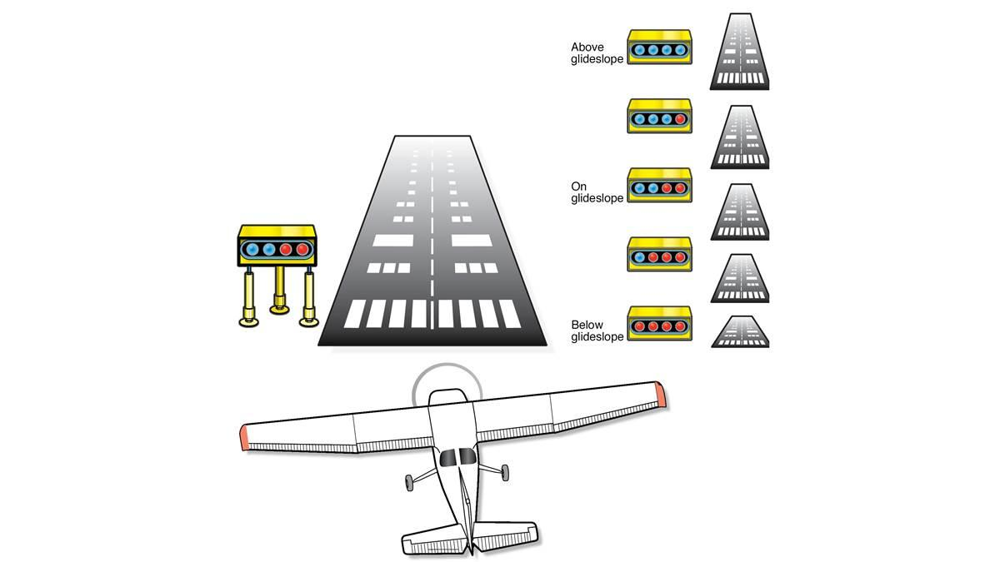

# PAPI Calibration System

## Overview
The Precision Approach Path Indicator (PAPI) Calibration System represents Phase 1 of our drone-based flight calibration initiative. This document details the specific implementation, methodology, and requirements for using autonomous drones to calibrate PAPI systems at airports.

## PAPI Calibration Gallery

<div class="image-grid">
    <div class="grid-item">
        
        <p>Standard PAPI light configuration</p>
    </div>
    <div class="grid-item">
        
        <p>PAPI approach angle visualization</p>
    </div>
</div>

<style>
.image-grid {
    display: grid;
    grid-template-columns: repeat(2, 1fr);
    gap: 20px;
    margin: 30px 0;
}
.grid-item {
    text-align: center;
}
.grid-item img {
    max-width: 100%;
    border-radius: 5px;
    box-shadow: 0 4px 8px rgba(0,0,0,0.1);
}
.grid-item p {
    margin-top: 8px;
    font-style: italic;
}
</style>

## What is PAPI?

```markdown
A Precision Approach Path Indicator (PAPI) is a visual aid that provides guidance for pilots during runway approach.

| PAPI Light Pattern | Meaning | Action Required |
|-------------------|---------|-----------------|
| All white | Too high | Descend substantially |
| 3 white, 1 red | Slightly high | Descend slightly |
| 2 white, 2 red | Correct path | Maintain approach angle |
| 1 white, 3 red | Slightly low | Climb slightly |
| All red | Dangerously low | Climb immediately |
```

The standard PAPI system consists of four light units positioned beside the runway that create these distinct patterns based on the aircraft's approach angle.

## Why PAPI Calibration Matters
Accurate PAPI calibration is critical for flight safety as it:
- Ensures pilots receive precise visual guidance during approach
- Prevents potential runway excursions or hard landings
- Maintains standardized approach paths across different airports
- Provides reliable guidance in varied weather conditions
- Meets regulatory requirements set by aviation authorities

## Current Calibration Challenges
Traditional PAPI calibration requires:
- Specialized aircraft with photometric equipment
- Multiple flyovers at precise angles
- Significant runway operational disruption
- Substantial expenses (typically $15,000-25,000 per calibration)
- Scheduling constraints leading to potential delays in maintenance

## Our Drone-Based Solution

### System Components

```markdown
#### 1. Specialized Calibration Drone

| Component | Specification | Function |
|-----------|---------------|----------|
| Optical System | 4K HDR cameras with polarizing filters | Detection and analysis of PAPI light transitions |
| Positioning | RTK-GNSS with ±2cm accuracy | Precise spatial reference for measurements |
| Flight Control | Redundant autopilot system | Automated path execution with failsafes |
| Stabilization | 6-axis gyroscopic platform | Consistent measurements in variable conditions |
| Weatherproofing | IP54 rated enclosure | Operation in light precipitation and dust |

#### 2. Calibration Software

| Module | Function | Output |
|--------|----------|--------|
| Path Planning | Generate optimal flight trajectories | 3D flight paths with measurement points |
| Photometric Analysis | Process light intensity and color data | Spectral analysis of PAPI transitions |
| Angular Measurement | Calculate precise approach angles | Deviation reports with error margins |
| Compliance Verification | Compare results to ICAO standards | Pass/fail status with recommendations |
| Documentation | Generate calibration certificates | PDF/digital reports for regulatory submission |

#### 3. Ground Control Station

| Feature | Capability | Benefit |
|---------|------------|---------|
| Mission Control | Real-time monitoring and intervention | Operational safety and quality assurance |
| Data Visualization | 3D representations of flight paths and results | Immediate feedback on calibration status |
| Quality Assurance | Automated error checking and validation | Elimination of measurement anomalies |
| Obstacle Detection | LiDAR-based environment scanning | Enhanced operational safety |
| ATC Integration | Communication with tower systems | Seamless integration with airport operations |
```

### Calibration Methodology
1. **Pre-Flight Preparation**
   - System integrity checks
   - Weather condition verification
   - Airspace coordination
   - Definition of calibration parameters based on runway specifications

2. **Automated Calibration Flight**
   - The drone performs a series of approaches along the runway centerline
   - Multiple elevation angles are sampled to verify PAPI transition points
   - Horizontal coverage area is verified to ensure visibility from approach path
   - Light intensity measurements are recorded at various distances

3. **Data Analysis & Reporting**
   - Angular measurements are compared against ICAO specifications
   - Light intensity is analyzed for compliance with visibility requirements
   - Transition zones between color changes are precisely mapped
   - Comprehensive calibration report is generated automatically

### Technical Specifications

#### Drone Platform
- **Flight Time**: 45+ minutes (sufficient for complete PAPI calibration)
- **Positioning Accuracy**: ±2cm horizontal, ±3cm vertical with RTK-GNSS
- **Weather Tolerance**: Operation in winds up to 25 knots, light precipitation
- **Optical System**: High-resolution cameras with specialized filters for PAPI light detection
- **Data Link**: Encrypted, redundant communication with 5km range

#### Measurement Capabilities
- **Angular Measurement Precision**: ±0.01° (exceeding ICAO requirements)
- **Light Intensity Measurement**: 0.01 to 100,000 cd/m²
- **Color Analysis**: Spectral analysis for precise red/white transition verification
- **Distance Range**: Effective measurements from 50m to 8km from threshold

### Implementation Process
1. **Site Survey & Planning**
   - Runway and PAPI system documentation review
   - Environmental assessment
   - Identification of safe operating areas
   - Creation of custom calibration profile

2. **System Deployment**
   - Ground station setup in designated area
   - Pre-flight checks and calibration
   - Coordination with local ATC
   - System initialization and verification

3. **Calibration Operation**
   - Automated flight execution
   - Real-time monitoring and data collection
   - Multiple approach angles for comprehensive assessment
   - Documentation of environmental conditions

4. **Analysis & Certification**
   - Automated data processing and analysis
   - Generation of compliance report
   - Comparison with historical data if available
   - Official calibration certification

### Regulatory Compliance
Our PAPI calibration methodology adheres to:
- ICAO Annex 14, Volume I, Chapter 5 requirements
- FAA Advisory Circular 150/5345-28 (where applicable)
- Local aviation authority standards
- Manufacturer specifications for specific PAPI systems

## Advantages Over Traditional Methods

```markdown
| Metric | Traditional Aircraft Method | Drone-Based Method | Improvement |
|--------|---------------------------|-------------------|-------------|
| **Cost** | $15,000-25,000 per calibration | $2,500-5,000 per calibration | 75-85% reduction |
| **Setup Time** | 24-48 hours advance scheduling | 1-2 hours deployment | 90% reduction |
| **Calibration Duration** | 4-8 hours of runway time | 1-2 hours of runway time | 75% reduction |
| **Measurement Precision** | ±0.05° angular accuracy | ±0.01° angular accuracy | 5x improvement |
| **Weather Dependency** | High - requires VFR conditions | Moderate - operates in varied conditions | Enhanced flexibility |
| **Documentation** | Manual reporting with limited data | Automated digital records with comprehensive data | Enhanced compliance |
| **Scheduling Flexibility** | Limited by aircraft availability | On-demand deployment | Minimal maintenance delays |
| **Environmental Impact** | High fuel consumption and emissions | Minimal battery power consumption | 95% carbon footprint reduction |
```

The drone-based method represents a transformative approach that maintains or improves calibration quality while drastically reducing costs, time requirements, and environmental impact.

## Case Studies
- [Airport Case Study 1: Regional Airport Implementation](./case-studies/regional-airport.pdf)
- [Airport Case Study 2: International Airport Integration](./case-studies/international-airport.pdf)

## Next Steps
After successful implementation of Phase 1, we plan to:
1. Expand capabilities to include calibration of approach lighting systems
2. Integrate with airport maintenance management systems
3. Develop enhanced night operations capabilities
4. Create a cloud-based calibration record management system
5. Establish regional drone calibration hubs for multiple airport support

## Contact Information
For specific information about our PAPI Calibration System, please contact:
- Technical Support: tech@drone-calibration.com
- Implementation Team: implementation@drone-calibration.com
- Phone: +123 456 7890

## Documentation & Resources
- [PAPI Calibration System Technical Manual](./docs/technical-manual.pdf)
- [Operational Guidelines](./docs/operational-guidelines.pdf)
- [Training Materials](./docs/training-materials.pdf)
- [System Specifications](./docs/system-specifications.pdf)